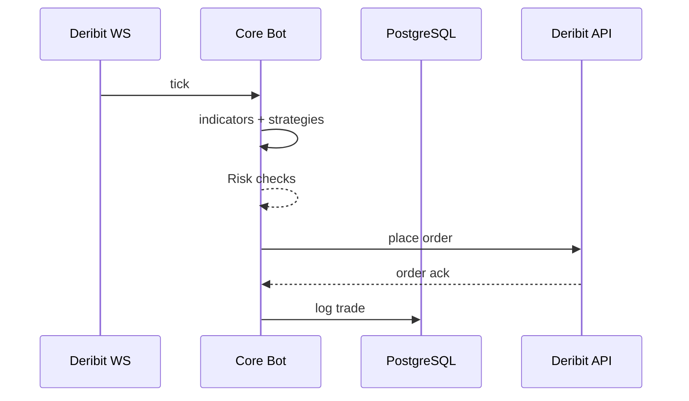

# 0 DTE Crypto Options Bot Architecture

## 1. Executive Overview
- **Objective:** Deploy a high-performance automated and semi-automated options trading bot for BTC & ETH on Deribit.
- **Key Features:** real-time data feed, pluggable strategies, risk controls, live dashboard, zero-downtime deploys.
- **Risks:** market liquidity, exchange latency, software bugs, infrastructure outages.
- **Success Metrics:** Sharpe > 2, uptime > 99%, max daily loss < 4% NLv, latency < 1s from signal to order.

## 2. Technology Stack
- **Next.js 14 (App Router, TypeScript)** for UI, API routes, background jobs.
- **Node.js 20** runtime.
- **WebSocket** for Deribit market data and bot->browser updates.
- **PostgreSQL** via Prisma ORM for trades, configs, P&L.
- **Redis** for state cache and BullMQ job queue.
- **Docker & GitHub Actions** for CI/CD to AWS EC2 or Fly.io.

## 3. System Architecture
```mermaid
flowchart LR
  FE[Next.js Front-end]
  API[API Route / WebSocket Gateway]
  FE <--> API
  subgraph CoreBot[Core Bot Engine]
    DF[DataFeed]
    IE[IndicatorEngine]
    SE[StrategyEngine]
    RM[RiskManager]
    EM[ExecutionModule]
    ST[(Redis + PostgreSQL)]
    Q[Job Queue (BullMQ)]
  end
  API --> CoreBot
  CoreBot --> Deribit[(Deribit API)]
```

## 4. Module Specs
### DataFeed
- **Purpose:** subscribe to Deribit WS, normalize ticks.
- **Classes:** `DataFeed.connect(): void`, emits `message` events.
- **Errors:** retry with exponential backoff, emit circuit breaker after 5 retries.
- **Tests:** WS mock via msw validating reconnection.

### IndicatorEngine
- **Purpose:** compute RSI, IMI, Bollinger Bands, ATR.
- **Methods:** `rsi(values:number[]):number`, `imi(open:number[], close:number[]):number` etc.
- **Tests:** deterministic indicator calculations.

### StrategyEngine
- **Purpose:** generate trade signals from indicators.
- **Method:** `generate(state:MarketState):TradeSignal[]`.
- **Events:** emits `TradeSignal` JSON schema defined in `src/engine/types.ts`.
- **Tests:** verify signals under mocked market states.

### RiskManager
- **Purpose:** enforce position sizing, daily drawdown, circuit breaker.
- **Methods:** `validate(signal,equity)`, `recordLoss(pct)`, `canTrade()`.
- **Errors:** pause trading when limits breached.

### ExecutionModule
- **Purpose:** place smart-limit orders on Deribit.
- **Method:** `placeOrder(signal):Promise<OrderAck>`.
- **Errors:** retry x3 with incremental backoff; bubble final error.

### JobQueue
- **Purpose:** schedule heartbeats, hedging, end-of-day close.
- **Class:** `JobQueue.scheduleHeartBeat()` etc.

## 5. Strategies
### Momentum Long Option
```pseudo
if RSI5 < 30 and price touches lowerBB:
    buy call
elif RSI5 > 70 and price touches upperBB:
    buy put
exit on +100% gain or -50% stop
```
### Iron Condor
```pseudo
if IVRank > 60 and realizedVol low:
    sell call strike +5%
    sell put strike -5%
    buy wings at ±8%
auto-close at 70% credit or T-20m
```
### Short ATM Straddle + Delta-Hedge
```pseudo
if IV < 30:
    sell ATM call and put
while position open:
    hedge underlying every ±100 USD delta
```

## 6. Risk Rules
- Max 1% NLv risk per trade.
- Daily stop-loss 4% ⇒ bot flat until next UTC day.
- No new trades in final 15m pre-expiry.
- Circuit breaker: if WS lag >5s, enter safe mode (only closes).

## 7. Configuration
- `config/bot.yml` with env overrides.
- Hot reload via PM2 graceful reload triggered from UI or file watcher.

## 8. Front-End
- TailwindCSS + shadcn/ui.
- Live chart, open positions, P&L.
- Trade Suggestions panel for semi-auto mode.
- Global toggles: Auto/Semi, Pause, Close-All, Strategy selector.

## 9. Deployment
- `docker-compose.yml` orchestrates Postgres, Redis, Next.js.
- GitHub Actions pipeline → build, test, push, deploy via SSH to EC2.
- Secrets in AWS Parameter Store. Logs via CloudWatch or Loki.

## 10. Testing
- Jest unit tests per module (msw for WS).
- Playwright integration for UI.
- 7-day paper run checklist before production.

## 11. Security
- Never log API secrets.
- HTTPS only; basic auth on dashboard if public.
- Graceful shutdown cancels orders and persists state.

## Sequence Diagram

